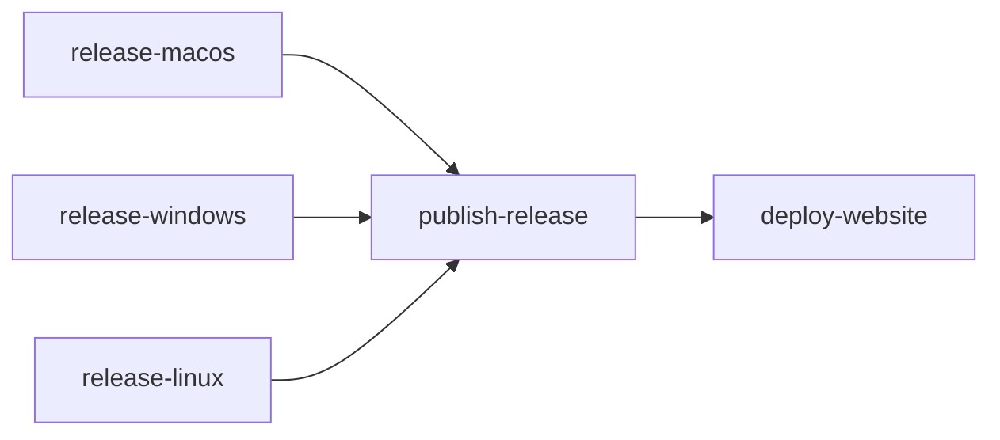

# Astro Landing Page with GitHub Pages Deployment

## Workspace Setup

Add `[pnpm-workspace.yaml](pnpm-workspace.yaml)` at repo root:

```yaml
packages:
  - "website"
```

Root stays as the Tauri app workspace (avoids changing any Tauri/Vite paths). `website/` is the only new workspace package.

### Collateral changes to existing config

- `[tsconfig.json](tsconfig.json)`: add `"exclude": ["website"]` — prevents root `tsc` from checking Astro files
- `[.gitignore](.gitignore)`: add `website/dist` and `website/.astro`
- `[biome.json](biome.json)`: already scoped to `app/**` for TS — no change needed (`**/*.json` matching website JSONs is fine for consistent formatting)
- `[lefthook.yml](lefthook.yml)`: no change needed — staged-file-based, biome scope filters naturally

## Astro Site (`website/`)

```text
website/
├── package.json
├── astro.config.mjs
├── tsconfig.json
├── src/
│   ├── layouts/
│   │   └── Layout.astro
│   ├── pages/
│   │   └── index.astro
│   ├── components/
│   │   ├── Hero.astro
│   │   ├── Features.astro
│   │   ├── Downloads.astro
│   │   └── Footer.astro
│   ├── lib/
│   │   └── github.ts
│   └── styles/
│       └── global.css
└── public/
    └── favicon.ico
```

### Key config — `website/astro.config.mjs`

```js
import { defineConfig } from "astro/config";
import tailwindcss from "@tailwindcss/vite";

export default defineConfig({
  site: "https://arpitdalal.github.io",
  base: "/yt-downloader",
  output: "static",
  vite: {
    plugins: [tailwindcss()],
  },
});
```

### Download data — `website/src/lib/github.ts`

At **build time**, fetches `https://api.github.com/repos/arpitdalal/yt-downloader/releases/latest` and maps assets by extension:

- `.dmg` -> macOS (Apple Silicon)
- `.exe` -> Windows (x64)
- `.AppImage` -> Linux (AppImage)
- `.deb` -> Linux (Debian/Ubuntu)
- `.rpm` -> Linux (RPM, if present)

Returns structured data: `{ tag, version, assets: { macos, windows, linuxAppImage, linuxDeb, linuxRpm? } }` with each asset having `{ name, url, size }`.

**Why fetch from API instead of constructing URLs**: the release tag (`v2.0.4`) and filename version (`2.0.0`) can differ (they do currently). Asset filenames are Tauri-generated and opaque. API fetch is the only reliable approach.

### Landing page — single page with sections

1. **Hero**: app name, one-line description, primary download button (OS-detected client-side via `navigator.userAgent`), secondary "Other platforms" link
2. **Features**: grid/cards — YouTube download, local file processing, section cutting/concat, browser cookie auth, cross-platform
3. **Downloads**: all platforms listed with file sizes, explicit links for each format
4. **Footer**: GitHub repo link, license, version

OS detection is a small inline `<script>` that reads `navigator.userAgent`, adds a data attribute to the hero download button to highlight the correct OS. All download links are statically rendered — JS only controls which one is visually primary.

### Styling

Tailwind CSS 4 (same as app for tooling consistency). Dark theme, modern/minimal aesthetic matching a developer tool landing page.

## CI/CD — Release Deploy

Add `deploy-website` job to `[tauri-release.yml](.github/workflows/tauri-release.yml)` after `publish-release`:

```yaml
deploy-website:
  if: startsWith(github.ref, 'refs/tags/v')
  needs: [publish-release]
  runs-on: ubuntu-22.04
  permissions:
    pages: write
    id-token: write
  environment:
    name: github-pages
    url: ${{ steps.deployment.outputs.page_url }}
  steps:
    - uses: actions/checkout@v4
    - uses: pnpm/action-setup@v4
      with:
        version: 10
    - uses: actions/setup-node@v4
      with:
        node-version: "20"
        cache: "pnpm"
    - run: pnpm install --frozen-lockfile
    - run: pnpm --filter website build
    - uses: actions/upload-pages-artifact@v3
      with:
        path: website/dist
    - id: deployment
      uses: actions/deploy-pages@v4
```




Top-level permissions in `tauri-release.yml` need `pages: write` and `id-token: write` added (or set at job level).

## CI/CD — Manual Deploy

New workflow `[deploy-website.yml](.github/workflows/deploy-website.yml)`:

```yaml
name: Deploy Website
on:
  workflow_dispatch:
permissions:
  contents: read
  pages: write
  id-token: write
jobs:
  deploy:
    runs-on: ubuntu-22.04
    environment:
      name: github-pages
      url: ${{ steps.deployment.outputs.page_url }}
    steps:
      - uses: actions/checkout@v4
      - uses: pnpm/action-setup@v4
        with:
          version: 10
      - uses: actions/setup-node@v4
        with:
          node-version: "20"
          cache: "pnpm"
      - run: pnpm install --frozen-lockfile
      - run: pnpm --filter website build
      - uses: actions/upload-pages-artifact@v3
        with:
          path: website/dist
      - id: deployment
        uses: actions/deploy-pages@v4
```

No inputs needed — the site always fetches latest release from GitHub API at build time. Works for both post-release deploys (latest release = just-published) and content-only deploys.

## Manual Step (post-implementation)

In GitHub repo settings: **Settings > Pages > Source** -> set to **"GitHub Actions"** (not "Deploy from a branch").

## What stays unchanged

- All Tauri build/dev commands (`pnpm tauri:dev`, `pnpm tauri:build`, etc.)
- Root `package.json` scripts
- `tauri.conf.json` paths
- `tauri-gate.yml` (website is too simple to gate; can add later)
- `vite.config.ts`
