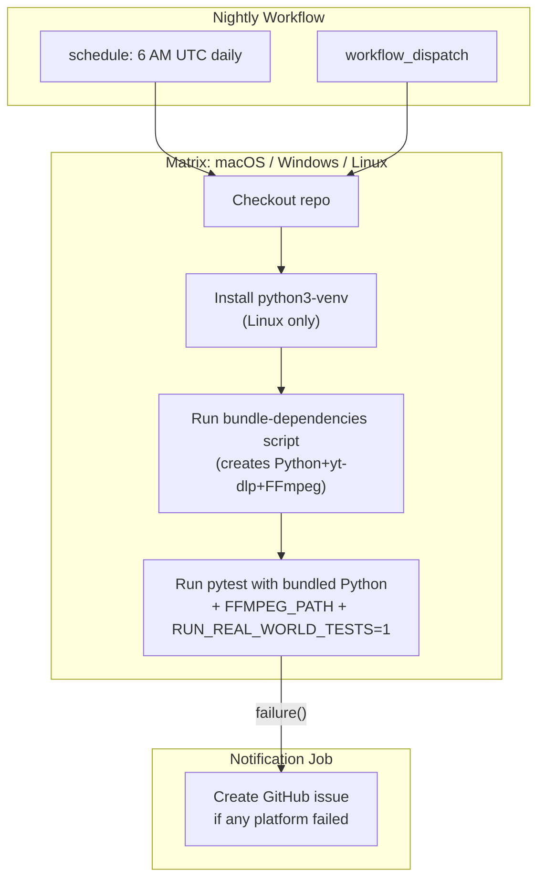

# Nightly Real-World YouTube Download Tests

## Shortcomings in Current Test

`[python/test_downloader_real_world.py](python/test_downloader_real_world.py)` has **6 gaps** vs how the app actually behaves on a user's device:

### 1. Wrong quality format string (CRITICAL)

- **Test:** `bestvideo*+bestaudio` (any container)
- **App** (`[src-tauri/src/lib.rs:331](src-tauri/src/lib.rs)`): `bestvideo[ext=mp4]+bestaudio[ext=m4a]/best[ext=mp4]/best` (mp4-only with fallback chain)
- **Impact:** Test may pass with webm streams that the real app would reject or need FFmpeg to transcode. Masks container-specific failures.

### 2. Low-quality fallback enabled (CRITICAL)

- **Test:** `YT_DLP_ALLOW_LOW_QUALITY_FALLBACK=true`
- **App:** This env var is never set (defaults to `false`)
- **Impact:** Completely defeats the purpose of the nightly. If YouTube blocks HQ adaptive streams but progressive 360p still works, the test passes while real users get errors.

### 3. Sections format mismatch

- **Test:** `[{"start": 0, "end": null}]` -- forces FFmpeg to seek to 0 (`ffmpeg -ss 0 -i ...`)
- **App default** (user clicks download without setting sections): `[{"start": null, "end": null}]` -- plain copy (`ffmpeg -i ... -c copy ...`)
- **Impact:** Exercises a slightly different FFmpeg code path than the vast majority of users hit.

### 4. No FFmpeg validation

- The test passes `**os.environ` so FFMPEG*PATH propagates if set*, but nothing ensures FFmpeg is present. Without FFmpeg, yt-dlp can't merge separate video+audio streams (which `bestvideo+bestaudio` requires), so the download silently falls to a progressive stream or fails differently than the real app.

### 5. No video integrity check

- Only checks `st_size > 1_000_000` (1 MB). A corrupt/truncated file passes this check.

### 6. No `extract_video_info` test

- The app **always** calls `--validate` before downloading. If info extraction breaks but download still works by luck, the nightly wouldn't catch it.

---

## Fix: `python/test_downloader_real_world.py`

### Change the existing `test_real_world_download_cli`:

- Quality string -> `bestvideo[ext=mp4]+bestaudio[ext=m4a]/best[ext=mp4]/best`
- Sections -> `[{"start": null, "end": null}]`
- **Remove** `YT_DLP_ALLOW_LOW_QUALITY_FALLBACK=true` from env
- Raise min file size to `5_000_000` (5 MB) -- even a 30s clip at 720p should exceed this
- Add ffmpeg-based video integrity check: if `FFMPEG_PATH` is set, run `ffmpeg -v error -i <file> -t 5 -f null -` (decode first 5s; proves file is playable and FFmpeg works). This is optional -- skipped gracefully if no FFmpeg.

### Add 2 ultra-stable URLs to the parametrize list (keep existing 2):

- Rick Astley - Never Gonna Give You Up (`dQw4w9WgXcQ`) -- one of the most viewed videos, will never be deleted
- YouTube Rewind 2018 (`YbJOTdZBX1g`) or another YouTube-official video

### Add new test: `test_extract_video_info_cli`

- Runs `python downloader.py --validate <url>` for each URL
- Asserts success, non-empty title, positive duration
- Catches info-extraction breakage independently of download

---

## New: `.github/workflows/nightly-download-test.yml`

**Key design choice: lean workflow.** We do NOT need Node.js, pnpm, Rust, Cargo, or Tauri build. We only need the bundled Python (with yt-dlp) + bundled FFmpeg from the bundle-dependencies scripts.

```
trigger:  schedule cron '0 6 * * *'  +  workflow_dispatch
matrix:   macos-14, windows-2022, ubuntu-22.04
```

### Steps per platform:

1. **Checkout**
2. **Install python3-venv** (Linux only -- `apt-get install python3 python3-pip python3-venv`)
3. **Run bundle-dependencies** (platform-conditional, same as gate workflow)

- This creates `src-tauri/resources/python/` (Python venv with yt-dlp + pytest) and `src-tauri/resources/ffmpeg/`

1. **Run real-world tests** with bundled Python:

- **macOS/Linux:**
- **Windows (pwsh):**
  ```
  $env:FFMPEG_PATH = "src-tauri\resources\ffmpeg\ffmpeg.exe"
  $env:RUN_REAL_WORLD_TESTS = "1"
  $env:YT_DLP_ENABLE_BROWSER_COOKIES = "false"
  src-tauri\resources\python\python.exe -m pytest `
    python\test_downloader_real_world.py -s -v
  ```

### On failure: create GitHub issue + email

Add a final job that runs `if: failure()` using `actions/github-script` to create a GitHub issue titled "Nightly download test failed on {date}" with a link to the failed run. GitHub's built-in email notifications will also fire for the repo owner.

---

## Flow diagram


