# Replace Cookie Sync with Direct Browser Cookie Access

## Context from Debug Session

The debug proved that the cookie-file-sync approach is broken:

- Cookie jar `.save()` corrupts domain prefixes (`accounts.google.com` instead of `.google.com`)
- Even with valid file, YouTube bot detection blocks yt-dlp
- Direct `--cookies-from-browser chrome` also fails currently, but this is the **officially recommended** yt-dlp approach and is the most likely to work as yt-dlp updates its bot-bypass logic
- The 13 sequential fallback attempts make failures take 12+ seconds

## Existing Changes

The branch `codex/tauri-migration` has ~1634 lines of uncommitted changes across 6 files. These changes include the YouTube auth feature (cookie sync, UI, Rust commands). **Do NOT discard all changes.** Most of the code (validation, download flow, sections, local processing) is unrelated to auth. Only the cookie-sync-specific parts need modification.

## Architecture Change

```mermaid
flowchart TD
    subgraph current [Current - Broken]
        A1[User clicks Connect YouTube] --> B1[Python syncs cookies to file]
        B1 --> C1[File passed via YT_DLP_COOKIES_FILE]
        C1 --> D1[yt-dlp reads stale/corrupted file]
        D1 --> E1[Bot detection - FAIL]
    end
    subgraph proposed [Proposed - Direct]
        A2[User clicks Download] --> B2[Rust detects installed browsers]
        B2 --> C2["yt-dlp --cookies-from-browser chrome"]
        C2 --> D2[yt-dlp reads fresh cookies directly]
        D2 --> E2[Best chance of success]
    end
```

## File Changes

### 1. Python: [python/downloader.py](python/downloader.py)

**Remove:**

- `sync_youtube_cookies()` method entirely
- `_cookie_jar_youtube_auth_stats()` and `_cookie_jar_has_youtube_auth_cookies()` helper methods
- `YOUTUBE_AUTH_COOKIE_NAMES` constant
- `--sync-cookies` CLI mode in `main()`
- Cookie file candidate logic (`_cookies_file_candidate()`)

**Simplify `extract_video_info()`:**

- Remove the cookie_file attempt
- Keep: default (no cookies) -> detected browser cookies-from-browser -> mweb -> android
- Reduce to ~4-5 attempts max instead of 13

**Simplify `download_video()`:**

- Remove `hq_cookie_file` profile
- Keep: hq -> hq*cookie*{browser} (for detected browser only, not all 9) -> hq_mweb -> restricted_progressive
- Remove `YT_DLP_COOKIES_FILE` env var handling

### 2. Rust: [src-tauri/src/lib.rs](src-tauri/src/lib.rs)

**Remove:**

- `connect_youtube` command (cookie sync flow)
- `clear_youtube_auth` command
- `sync_youtube_cookies_from_browsers()` function
- `youtube_auth_cookie_path()` function
- `read_youtube_auth_status()` function
- `validate_cookie_file()` and `cookie_file_has_auth_markers()`
- `set_private_dir_permissions()` / `set_private_file_permissions()`
- `YOUTUBE_AUTH_COOKIE_NAMES`, `YOUTUBE_AUTH_DIR`, `YOUTUBE_COOKIES_FILENAME` constants
- Cookie file override logic in `yt_dlp_env_overrides()`

**Simplify:**

- `yt_dlp_env_overrides()`: Only pass `YT_DLP_ENABLE_BROWSER_COOKIES=true` and `YT_DLP_COOKIES_BROWSER` (detected browser)
- Keep `get_youtube_auth_status` command but rewrite to just check if a supported browser is detected (no file check)
- Remove `open_youtube_signin` command (no longer needed)

**Keep `is_youtube_auth_verification_error()**` for error classification on download failures.

### 3. Frontend: [app/App.tsx](app/App.tsx)

**Replace YouTube Connection UI section** (lines 563-609):

- Remove "Connect YouTube" / "Reconnect" / "Disconnect" buttons
- Replace with a passive status bar: "Browser detected: Chrome" or "No supported browser detected"
- Remove `isAuthBusy` state, `runYouTubeConnectFlow()`, `handleConnectYouTube()`, `handleDisconnectYouTube()`, `ensureYouTubeConnectedBeforeDownload()`

**Simplify download flow** (lines 441-447):

- Remove `ensureYouTubeConnectedBeforeDownload()` pre-check
- Keep `runWithYouTubeAuthReconnect()` but simplify: on auth error, just show message instead of trying to re-sync cookies

**Update error messages** (lines 110-123):

- Replace "Click Reconnect YouTube" messages with "Sign in to YouTube in your browser and try again"
- Remove YOUTUBE_AUTH_EXPIRED/REQUIRED distinction (no longer meaningful)

### 4. Frontend API: [app/lib/tauri-api.ts](app/lib/tauri-api.ts)

**Remove:**

- `connectYouTube()` method
- `clearYouTubeAuth()` method
- `openYouTubeSignIn()` method

**Keep:**

- `getYouTubeAuthStatus()` (repurposed to return detected browser info)

### 5. Tests: [python/test_downloader.py](python/test_downloader.py)

- Remove tests for `sync_youtube_cookies`
- Remove tests for cookie jar auth stats
- Update tests for simplified `extract_video_info` attempt list

## Error UX

When YouTube bot detection triggers:

- Show: "YouTube requires browser sign-in for this video. Please sign in to YouTube in Chrome/Arc and try again."
- Do NOT offer a "Connect" button that gives false hope
- If no browser detected: "No supported browser found. Install Chrome or Firefox and sign in to YouTube."
